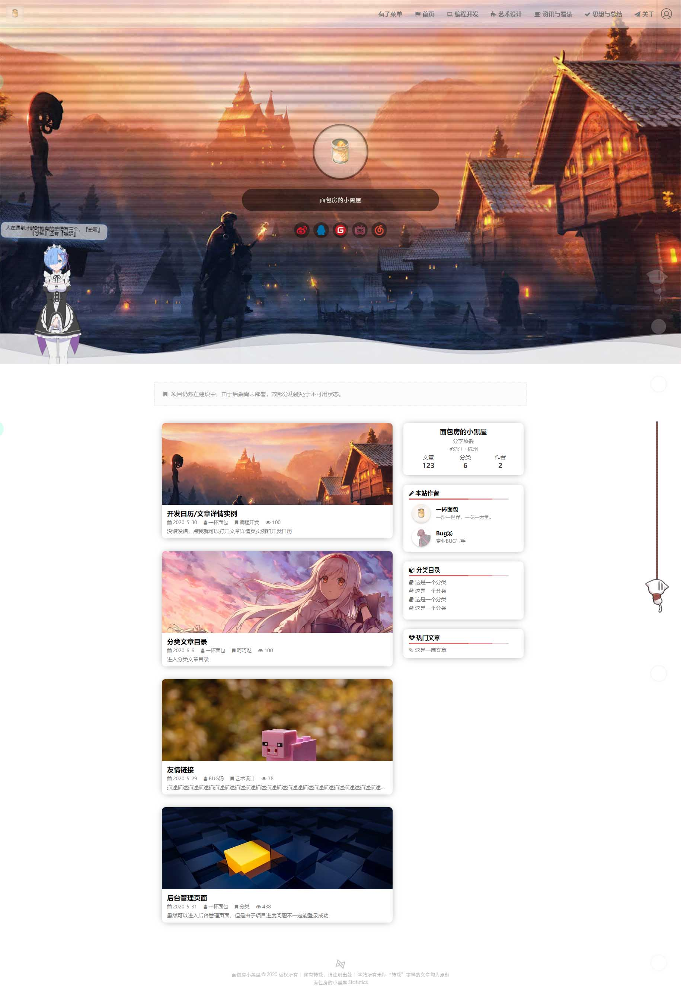

# Glanzz⭐：Glanzz 博客

## Introduce



这是一个前后端分离的博客项目，面包在 2020 年 2 月份的春节假期开始了 Vue 的学习，故制作一个博客项目作为实战。该项目将会持续更新，不断充实内容，完善功能。

该博客基于 Vue3 制作，采用前后端分离的模式。

项目已于2021.4.10开始重构，站点可能访问不稳定，敬请谅解。

希望你能喜欢！

项目预览演示地址：http://glanzz.hoh.ink/

## Dependency

| dependency | version |
|  ----  | ----  |
| axios  | 0.21.0 |
| core-js | 3.10.1 |
| element-ui | 2.15.1 |
| js-cookie | 2.2.1 |
| md5 | 2.3.0 |
| nprogress | 0.2.0 |
| vue | 3.0.11 |
| vue-router | 4.0.6 |
| vuex | 4.0.0 |
| node-sass | 4.14.1 |
| sass-loader | 8.0.2 |

## Project setup

```
npm install
```

### Compiles and hot-reloads for development

```
npm run serve
```

### Compiles and minifies for production

```
npm run build
```

### Lints and fixes files

```
npm run lint
```

## License

- GPL v3

## Contact

作者：一杯面包  
博客[文学]：[点击访问](https://blog.cupbread.cn/)  
站点[技术]：[点击访问](https://lab.cupbread.cn/)  
QQ:671547162  
邮箱：508087823@qq.com  
BILIBILI：https://space.bilibili.com/3300215

## Reward and Support

| 支付宝 | 微信 |
| ------ | ------------ |
|  |  |

## Update record

#### 2020-2-20

- 正式成立项目
- 项目初始化

#### 2020-5-25

- 后台部分总体完成
- 开始制作前台

#### 2021-4-10

- 项目重构
